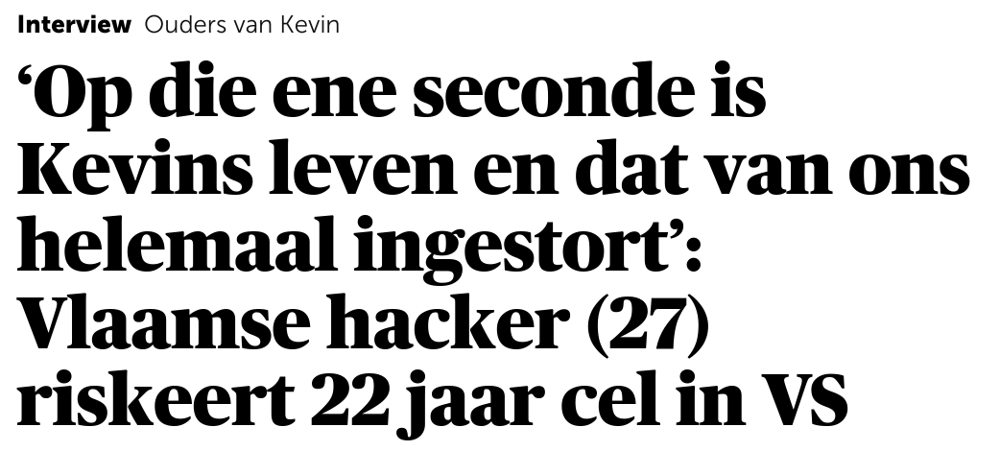
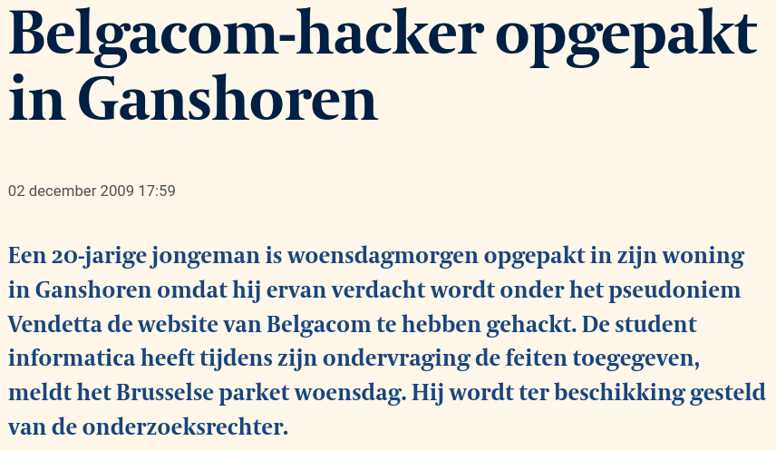
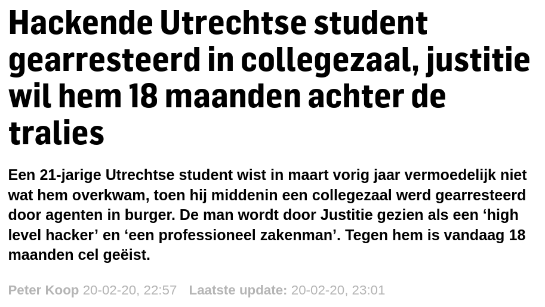

# Hoofdstuk 0: disclaimer

---

-   Enkel in een legale context
    -   Eigenaar of toestemming van eigenaar
-   Illegaal gebruik: kans op gerechtelijke vervolging
-   Op eigen verantwoordelijkheid!
    -   Lectoren/HOGENT: niet aansprakelijk
    -   Zie ook [OER](https://www.hogent.be/student/een-vlotte-start/onderwijs-en-examenregeling/) Art. 47. §7:

Notes:
Het materiaal in deze cursus dient louter en alleen voor onderwijsdoeleinden. Het materiaal in deze cursus mag enkel in een legale context gebruikt worden.!

-   Als je iets wil testen, dan doe je dit enkel op toestellen, netwerken, domeinen, ... die je zelf bezit of waarvan je de toestemming hebt van de eigenaar die ingelicht is over alle mogelijke risico's.
    -   Bv. in de labo's worden deze tools enkel op legale wijze gebruikt.
-   Illegaal gebruik kan leiden tot gerechtelijke stappen en gevolgen.
-   Het gebruik van het materiaal buiten de lesuren is op eigen verantwoordelijkheid. De lectoren en de school zijn niet aansprakelijk voor jouw acties.

---

    
    

    

Notes:

<!-- eerste link werkt enkel bij copy paste, niet bij klikken -->

-   https://www.demorgen.be/nieuws/op-die-ene-seconde-is-kevins-leven-en-dat-van-ons-helemaal-ingestort-vlaamse-hacker-27-riskeert-22-jaar-cel-in-vs~b081ed46/
-   https://www.tijd.be/telex/algemeen-binnenland/belgacom-hacker-opgepakt-in-ganshoren/8267574.html
-   https://www.gelderlander.nl/utrecht/hackende-utrechtse-student-gearresteerd-in-collegezaal-justitie-wil-hem-18-maanden-achter-de-tralies~aab49a1c/

---
