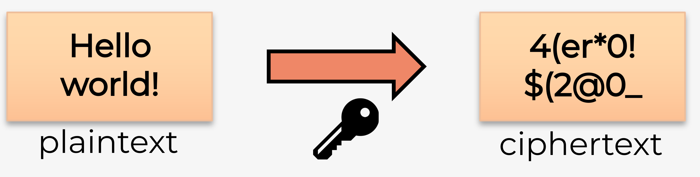
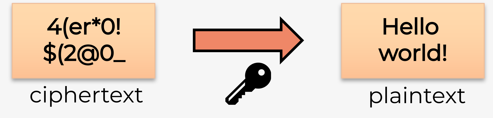
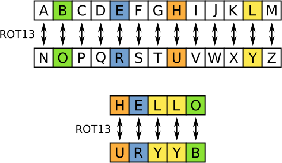

# Hoofdstuk 2: encryptie

---

## Encrypteren

---

## Decrypteren

---

## ROT13

-   Caesar's cipher
-   Gebruikt bij de Romeinen
-   https://rot13.com/

---

## Let's try!

-   7-zip & VeraCrypt om geëncrypteerde containers te maken
-   https://hogenttin.github.io/cybersecurity/h4/symmetrisch-encrypteren/symmetrisch-encrypteren/

---

## Wachtwoorden kraken

-   Dictionary attack
    -   https://www.kaggle.com/datasets/wjburns/common-password-list-rockyoutxt
    -   https://weakpass.com/wordlists/rockyou.txt
    -   https://www.ncsc.gov.uk/staticjson/static-assets/documents/PwnedPasswordsTop100k.txt
    -   https://weakpass.com/wordlists/10_million_password_list_top_1000000.txt
-   Brute force
    -   `aaa`, `aab`, `aac`, ... , `zzx`, `zzy`, `zzz`

---

## Zo gaat het niet ...

<iframe width="1280" height="720" src="https://www.youtube.com/embed/msX4oAXpvUE?si=i1ODpvQvOB7p4uKi" title="YouTube video player" frameborder="0" allow="accelerometer; autoplay; clipboard-write; encrypted-media; gyroscope; picture-in-picture; web-share" referrerpolicy="strict-origin-when-cross-origin" allowfullscreen></iframe>

---

## Let's try!

-   7-zip kraken met John the Ripper
-   https://hogenttin.github.io/cybersecurity/h4/zip-kraken/zip-kraken/

---
