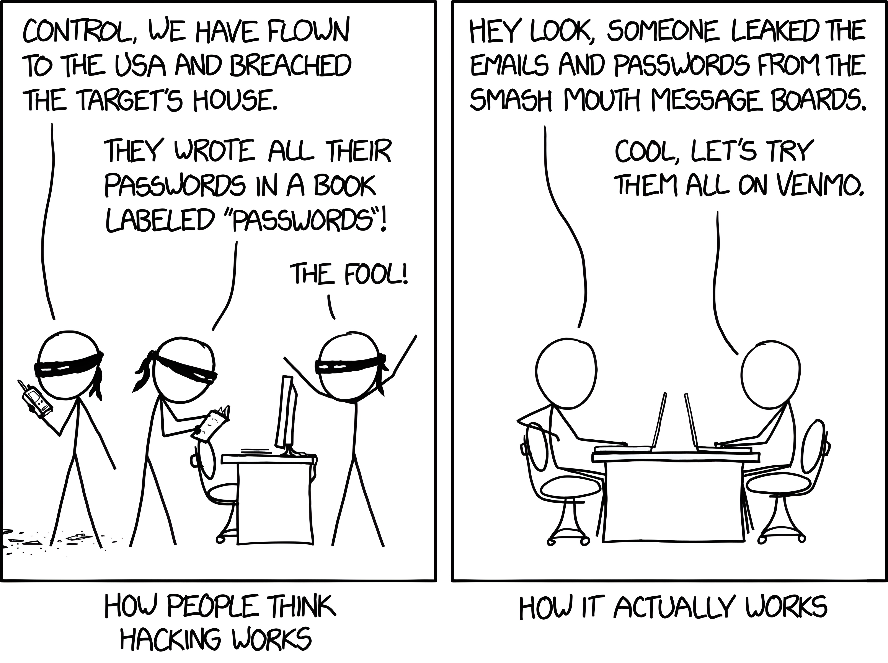
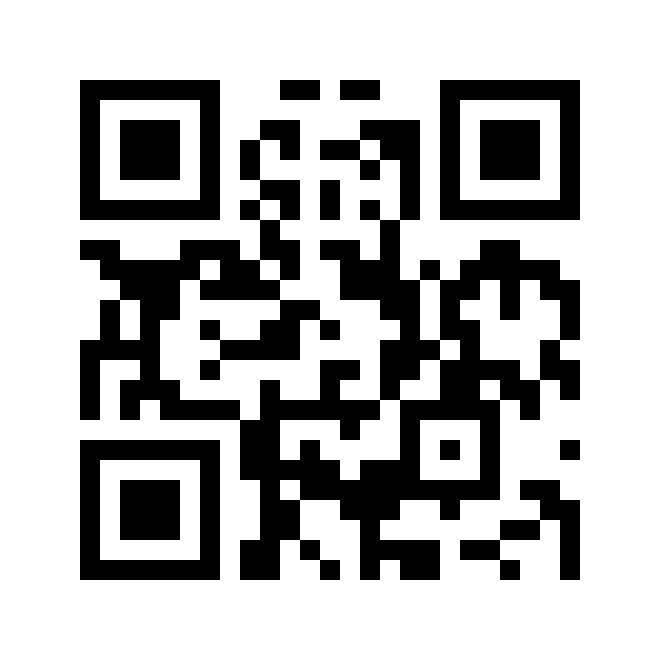

# Hoofdstuk 1: wachtwoorden

---

---

https://app.wooclap.com/KHODEI

---

## Wat is volgens jou een goed wachtwoord?

- Musti2012 &rarr; te kort, voorspelbaar
- A8!Kgh3 &rarr; te kort
- Ikstudeerophogent &rarr; voorspelbaar
- SchoonmeersenHOGENT &rarr; voorspelbaar
- 8765 &rarr; te kort, weinig complexiteit
- LiefKleinKonijntje &rarr; lang, NL (zolang de woorden random gekozen zijn)
- LiefKlijnKoneintje &rarr; lang, NL, typfout (zie hierboven)
- Shadow1Hogent &rarr; Truucjes helpen niet
- Shadow1Facebook &rarr; Truucjes helpen niet
- kmAIw0IlCUvX5nk9 &rarr; Ok! Kan je het onthouden?

---

- Experimenteer even met volgende links, maar steek hier niet jouw echte wachtwoorden in!
  - https://bitwarden.com/password-generator/
  - https://bitwarden.com/password-strength/

---

Notes:

- https://www.hivesystems.io/blog/are-your-passwords-in-the-green

---

Notes:

- https://twitter.com/TerahashCorp/status/1155112559206383616/photo/1
- Dit is een richtlijn, de daadwerkelijke tijd hangt af van het system, software, ... waarmee je het wachtwoord zou willen kraken.

---

- De **lengte** is dus heel belangrijk!
- Nog beter dan een wachtwoord is een **wachtzin** (**passphrase**)
  - "Purple Elephants Sliding Over Clouds"
  - "3@pples&Or@nges#Ban@nas"
  - "Chocolate Cake Is My Favourite dess3rt"
- https://useapassphrase.com

---

## Password policies: not done anymore

  

Notes:

- https://www.starlab.io/blog/why-enforced-password-complexity-is-worse-for-security-and-what-to-do-about-it

---

- Bedrijven hebben vaak password policies waardoor je je wachtwoord **regelmatig** moet **wijzigen**
- Volgende wachtwoordwijziging doe je best niet elke maand of je personeel heeft wachtwoorden als ...
  - January123, February123, ...
  - Summer2023
- Op die manier heeft wachtwoorden wijzigen **geen zin**
- Wordt tegenwoordig ook **afgeraden** (bv. door NIST)
- https://neal.fun/password-game

Notes:

- https://arstechnica.com/information-technology/2016/08/frequent-password-changes-are-the-enemy-of-security-ftc-technologist-says/
- https://bitwarden.com/resources/world-password-day/
- https://www.beyondtrust.com/blog/entry/top-15-password-management-best-practices
- https://nordpass.com/poor-company-passwords/
- https://bishopfox.com/blog/password-security

---

## Hoeveel wachtwoorden?

Notes:

- https://xkcd.com/792/

---

- https://haveibeenpwned.com/

---

- Gebruik voor elke website een **apart** wachtwoord!
- Bij **datalekken** worden vaak wachtwoorden op straat gegooid
  - Niet alle bedrijven zijn even zorgvuldig met hun beveiliging (of beveiligen niet!)
  - Hackers proberen deze wachtwoorden (geautomatiseerd) uit op andere sites
  - Hetzelfde wachtwoord gebruikt, kans groot dat ze op jouw andere accounts ook binnengeraken

---

- Gebruik **geen** trucjes
  - Bv. hogent19jan2023, google1nov1998, ...
  - Tools zoals hashcat en AI-hacktools herkennen dit meteen en kunnen zo al een gedeelte van het wachtwoord achterhalen
  - De effectieve ongekende lengte van het wachtwoord wordt een pak kleiner

Notes:

- `hogent19jan2023`, `google1nov1998` &rarr; website + dag + maand + jaar
  - 31 mogelijke dagen x 12 mogelijke maanden x 10000 mogelijke jaren == 3720000 mogelijkheden == 1 uur om te kraken bij 1000 mogelijkheden / sec
- 14 random karakters [kleine letters, hoofdletters, leestekens, ...
  - == 128^14 == 316912650057057350374175801344 mogelijkheden == +/- 10049234210332869000 jaar om te kraken bij 1000 mogelijkheden / sec

---

## Hoe onthouden?

- **Password managers** zijn zeker een goede oplossing
- Vullen wachtwoorden **automatisch** aan in de browser

<iframe width="1066" height="600" src="https://www.youtube.com/embed/hWqyPW0QJRk?si=PyDoAlUauL-L3Qhk" referrerpolicy="strict-origin-when-cross-origin" allowfullscreen></iframe>

---

- Voordelen:
  - Jouw wachtwoorden worden **versleuteld** opgeslagen
  - Je kan voor elke login een **aparte** username en wachtwoord instellen (niet vertrouwen op geheugen of post-it op scherm)
  - Heeft een ingebouwde password **generator**

---

- Nadelen:
  - Je **master password** is nu extreem belangrijk
  - Je **vertrouwt** het bedrijf achter de password manager
  - De software / plugins moet je 100% vertrouwen, en deze kunnen ook **bugs** hebben

---

Beter een password manager dan overal hetzelfde wachtwoord of voor de hand liggende variaties!

 

---

## 2FA

- Multi-Factor Authentication (**MFA**/**2FA**)
  - What you **know**
    - Wachtwoorden, wachtwoordzinnen, pincodes, ...
  - What you **have**
    - Smartcards, beveiligingssleutelhangers, toegang tot GSM (authenticator app of SMS), toegang tot e-mailaccount (verificatie e-mail), ...
  - Who you **are**
    - Biometrie: een uniek fysiek kenmerk zoals vingerafdruk, netvlies, stem, ...
  - **Minstens 2 van de 3** nodig

---

    

    

Notes:

- https://www.yubico.com/products/

---
